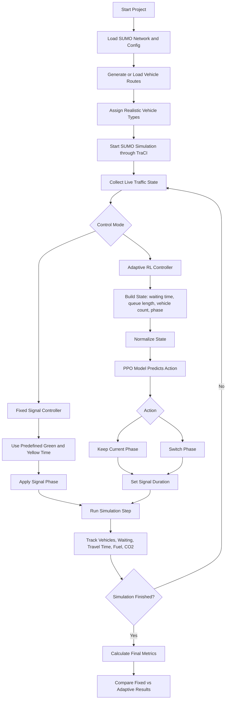
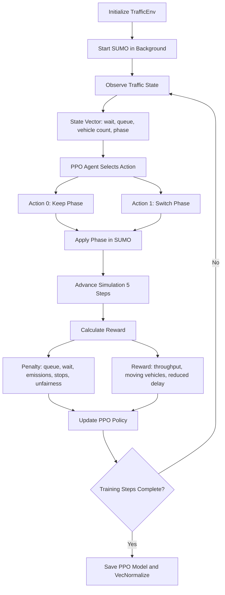

# Single Junction Adaptive Traffic Signal Control

## Project Summary

This project simulates a single traffic junction in SUMO and compares fixed-time traffic signal control with an adaptive Reinforcement Learning based controller. The adaptive system observes real-time traffic conditions such as waiting time, queue length, vehicle count, current signal phase, CO2 emission, and vehicle movement, then decides whether to keep the current phase or switch to the next green phase.

The main goal is to reduce congestion, waiting time, travel time, fuel consumption, and CO2 emission while improving vehicle throughput.

## Main Project Components

| Folder/File | Purpose |
|---|---|
| `network/city.net.xml` | SUMO road network for the single junction |
| `config/simulation.sumocfg` | SUMO simulation configuration |
| `routes/routes.rou.xml` | Vehicle route file used by the simulation |
| `scripts/edit_routes.py` | Adds realistic mixed vehicle types such as cars, bikes, buses, trucks, tankers, autos, and ambulance |
| `scripts/fixed.py` | Baseline fixed signal control model |
| `scripts/main.py` | Adaptive traffic control execution script using PPO model when available |
| `rl/traffic_env.py` | Custom Gymnasium environment connecting SUMO with Reinforcement Learning |
| `rl/train.py` | PPO training script using Stable-Baselines3 |
| `rl/test_model.py` | Multi-run model testing script |
| `rl/results.csv` | Experimental results for low, medium, and high scenarios |
| `models/*.zip` | Saved trained PPO models |

## System Flow Diagram



## Reinforcement Learning Training Flow



## How The Project Works

1. SUMO creates a traffic simulation for a single junction.
2. Vehicles are inserted into the road network using route files.
3. `edit_routes.py` makes the traffic more realistic by adding mixed vehicle categories.
4. TraCI connects Python with SUMO and reads live traffic data at every step.
5. The fixed model uses constant signal timing.
6. The adaptive model uses current traffic conditions and a trained PPO agent.
7. The PPO model decides whether to keep the current signal phase or switch it.
8. The system records performance using waiting time, travel time, throughput, fuel, and CO2 emission.
9. Results can be compared across low, medium, and high traffic scenarios.

## Mathematical Formulas Used

This section explains the formulas used in the project and how they help the controller make decisions.

### 1. Fixed Signal Timing

In the fixed controller, every signal phase is given a constant green time and yellow time.

```text
Cycle Time = Green Time + Yellow Time
```

In `scripts/fixed.py`:

```text
Green Time = 20 sec
Yellow Time = 5 sec
Cycle Time = 25 sec
```

Meaning:

- The signal changes after a predefined duration.
- It does not depend on the number of vehicles waiting.
- This is used as the baseline model.

### 2. Estimated Green Time For Vehicle Mix

The fixed controller also contains an optional green-time estimation formula based on vehicle type. Different vehicles need different crossing times.

```text
Tgreen = (Nc * Tc + Nr * Tr + Nb * Tb + Nt * Tt + Nbike * Tbike) / (L + 1)
```

Where:

| Symbol | Meaning |
|---|---|
| `Nc` | Number of cars |
| `Nr` | Number of rickshaws/autos |
| `Nb` | Number of buses |
| `Nt` | Number of trucks |
| `Nbike` | Number of bikes or motorcycles |
| `Tc, Tr, Tb, Tt, Tbike` | Average crossing time for each vehicle type |
| `L` | Number of controlled lanes |
| `Tgreen` | Estimated green time |

The project then bounds this value:

```text
10 <= Tgreen <= 60
```

Meaning:

- If many heavy vehicles are present, the estimated green time increases.
- If traffic is low, green time remains smaller.
- Bounding prevents extremely short or extremely long green phases.

### 3. Adaptive Priority Formula

In `scripts/main.py`, the non-RL fallback controller calculates a priority score for each lane.

```text
Priority = alpha * Predicted_Density + beta * Waiting_Time + gamma * Queue_Length + 2.0 * Arrival_Count
```

In the code:

```text
alpha = 1.2
beta = 0.7
gamma = 1.0
```

Where:

| Term | Meaning |
|---|---|
| `Predicted_Density` | Expected number of vehicles on the lane |
| `Waiting_Time` | Average waiting time of vehicles on the lane |
| `Queue_Length` | Number of stopped vehicles |
| `Arrival_Count` | Number of vehicles entering/seen in the lane |
| `alpha, beta, gamma` | Weights that control the importance of each factor |

If waiting time becomes too high:

```text
If Waiting_Time > MAX_WAIT_LIMIT:
    Priority = Priority + 30
```

Meaning:

- A lane with long waiting time gets extra priority.
- This reduces starvation, where one direction waits too long.

### 4. Traffic Prediction Formula

The project estimates the next traffic density using the current and previous density.

```text
Trend = Current_Density - Previous_Density
Predicted_Density = Current_Density + Trend
```

Meaning:

- If vehicles are increasing on a lane, predicted density becomes higher.
- If vehicles are decreasing, predicted density becomes lower.
- This gives the controller a simple short-term prediction.

### 5. Adaptive Green Time Formula

After calculating priority, the controller converts priority into green time.

```text
Green_Time = Base_Time + Priority * Factor
```

In the code:

```text
Base_Time = 10
Factor = 0.5
```

The result is bounded:

```text
MIN_GREEN <= Green_Time <= MAX_GREEN
```

In `scripts/main.py`:

```text
5 <= Green_Time <= 200
```

Meaning:

- Higher priority lanes receive longer green time.
- The minimum limit avoids unsafe rapid switching.
- The maximum limit prevents one direction from blocking all others.

### 6. Reinforcement Learning State Formula

The RL agent observes the traffic condition as a state vector:

```text
S = [Waiting_Time / 1000, Queue_Length / 50, Vehicle_Count / 100, Current_Phase / 4]
```

Where:

| State Value | Formula | Purpose |
|---|---|---|
| Normalized waiting time | `Waiting_Time / 1000` | Shows total delay |
| Normalized queue length | `Queue_Length / 50` | Shows congestion |
| Normalized vehicle count | `Vehicle_Count / 100` | Shows traffic volume |
| Normalized signal phase | `Current_Phase / 4` | Tells the agent current light state |

Meaning:

- Values are normalized so the PPO model can learn more stably.
- The agent does not directly see the whole road image; it sees numerical traffic features.

### 7. Reinforcement Learning Action

The action space is discrete:

```text
A = {0, 1}
```

| Action | Meaning |
|---|---|
| `0` | Keep the current signal phase |
| `1` | Switch to the other main green phase |

In the code:

```text
If action = 1:
    New_Phase = 2 if Current_Phase = 0 else 0
```

Meaning:

- The agent chooses between stability and switching.
- A minimum green duration prevents very fast phase changes.

### 8. PPO Reward Formula

The reward function tells the agent whether its action was good or bad.

The project uses a combined reward:

```text
Reward =
    - 1.5 * Queue_Length
    - 0.05 * Waiting_Time
    + 5 * Arrived_Vehicles
    - 0.5 * Queue_Imbalance
    - 2 * Switch_Penalty
    - 20 * Starvation_Penalty
    - 0.1 * Normalized_Emission
    + 0.5 * Moving_Vehicles
    - 0.2 * Stopped_Vehicles
    + Delay_Reduction
    - 2 * Idle_Green_Penalty
    - 30 * Max_Wait_Penalty
```

Finally:

```text
Reward = Reward / 100
```

Important terms:

| Term | Formula/Condition | Meaning |
|---|---|---|
| Queue penalty | `-1.5 * Queue_Length` | Penalizes congestion |
| Waiting penalty | `-0.05 * Waiting_Time` | Penalizes delay |
| Throughput reward | `+5 * Arrived_Vehicles` | Rewards vehicles completing trips |
| Fairness penalty | `-0.5 * (Max_Queue - Min_Queue)` | Penalizes imbalance between lanes |
| Switching penalty | `-2 if action = switch` | Avoids unnecessary signal changes |
| Starvation penalty | `-20 if max lane wait > 200 sec` | Protects long-waiting lanes |
| Emission penalty | `-0.1 * CO2/1000` | Reduces pollution |
| Moving reward | `+0.5 * Moving_Vehicles` | Encourages traffic flow |
| Stop penalty | `-0.2 * Stopped_Vehicles` | Reduces stop-and-go traffic |
| Delay reduction | `Previous_Wait - Current_Wait` | Rewards improvement over previous step |
| Idle green penalty | `-2 if queue = 0 and action = keep` | Avoids wasting green time |
| Max wait penalty | `-30 if max lane wait > 300 sec` | Strongly prevents extreme delay |

Meaning:

- The reward is multi-objective.
- The agent is not only trained to reduce waiting time.
- It also considers throughput, fairness, emissions, and smooth movement.

### 9. Performance Metric Formulas

These formulas are used to calculate final output values.

#### Average Waiting Time

```text
Average Waiting Time = Total Waiting Time / Number of Vehicles
```

#### Average Travel Time

```text
Average Travel Time = Total Travel Time / Vehicles Passed
```

For each vehicle:

```text
Travel Time = Exit Time - Entry Time
```

#### Throughput

```text
Throughput = Vehicles Passed / Simulation Time
```

Meaning:

- Higher throughput means more vehicles cleared per second.

#### Fuel Consumption

SUMO gives fuel consumption in small units over simulation steps. The project converts it to liters:

```text
Fuel in Liters = Total Fuel Consumption / 1,000,000
```

#### CO2 Emission

SUMO provides CO2 emission during simulation. The project converts total CO2 to kilograms:

```text
Total CO2 in kg = Sum of CO2 Emission History / 1,000,000
```

Average CO2 per second:

```text
Average CO2 per Second = Total CO2 / Number of Simulation Steps
```

## Algorithms Used

### Algorithm 1: Fixed-Time Signal Control

```text
Input:
    SUMO network, route file, simulation time

Initialize:
    Green_Time = 20 seconds
    Yellow_Time = 5 seconds
    Start SUMO using TraCI

For each simulation step:
    1. Read all active vehicles
    2. Track waiting time, fuel, CO2, and lane position
    3. For each traffic light:
        a. Check current cycle time
        b. Move to next signal phase after fixed duration
        c. Apply fixed green time
    4. Track arrived vehicles

After simulation:
    Calculate average waiting time
    Calculate average travel time
    Calculate fuel consumption
    Calculate CO2 emission
    Calculate throughput

Output:
    Fixed signal performance metrics
```

### Algorithm 2: Adaptive Priority-Based Control

```text
Input:
    Live lane data from SUMO

For each simulation step:
    1. For each controlled lane:
        a. Count vehicles
        b. Count stopped vehicles
        c. Calculate average waiting time
        d. Calculate arrival count
    2. Predict next density:
        Predicted_Density = Current_Density + (Current_Density - Previous_Density)
    3. Calculate priority:
        Priority = alpha * Predicted_Density
                 + beta * Waiting_Time
                 + gamma * Queue_Length
                 + 2.0 * Arrival_Count
    4. Add extra priority if waiting time is too high
    5. Select signal phase with highest total priority
    6. Calculate green time:
        Green_Time = Base_Time + Priority * Factor
    7. Apply selected phase and green duration

Output:
    Adaptive signal phase and duration
```

### Algorithm 3: PPO Reinforcement Learning Training

```text
Input:
    SUMO environment, observation space, action space

Initialize:
    PPO agent
    TrafficEnv
    Observation normalization

For each training step:
    1. Observe current state:
        S = [waiting, queue, vehicle_count, current_phase]
    2. PPO selects action:
        A = keep phase or switch phase
    3. Apply action in SUMO
    4. Advance simulation
    5. Calculate reward using queue, waiting, throughput, fairness, CO2, and stops
    6. Store experience
    7. PPO updates policy using collected experience

After training:
    Save trained PPO model
    Save VecNormalize statistics

Output:
    Trained PPO traffic signal controller
```

### Algorithm 4: PPO-Based Adaptive Signal Testing

```text
Input:
    Trained PPO model, SUMO traffic simulation

Initialize:
    Load PPO model
    Load VecNormalize
    Start SUMO

For each simulation step:
    1. Read waiting time, queue length, vehicle count, and current phase
    2. Normalize the state
    3. PPO predicts action
    4. If action is 0:
        Keep current phase
    5. If action is 1:
        Switch signal phase
    6. Track vehicle exits, travel time, CO2, and throughput

After simulation:
    Save or print performance metrics

Output:
    Adaptive RL performance results
```

## State, Action, Reward

### State

The RL agent receives four normalized values:

| State Feature | Meaning |
|---|---|
| Waiting time | Total lane waiting time |
| Queue length | Total halted vehicles |
| Vehicle count | Number of vehicles currently in simulation |
| Current phase | Current traffic signal phase |

### Action

| Action | Meaning |
|---|---|
| 0 | Keep current signal phase |
| 1 | Switch to the other main green phase |

### Reward Logic

The reward encourages:

- More vehicles reaching destination
- More moving vehicles
- Reduced waiting time
- Reduced queue length
- Reduced delay

The reward penalizes:

- Long queues
- High waiting time
- Frequent signal switching
- CO2 emissions
- Stopped vehicles
- Starvation of one road direction
- Idle green signals

## Fixed vs Adaptive Difference

| Point | Fixed Signal System | Adaptive RL System |
|---|---|---|
| Signal timing | Predefined constant timing | Learns phase decisions from traffic state |
| Traffic awareness | Does not react to congestion | Uses queue, waiting time, vehicles, and phase |
| Decision method | Rule based cycle | PPO Reinforcement Learning |
| Performance goal | Simple control baseline | Reduce wait, queue, emission, and delay |
| Flexibility | Same timing for all traffic | Changes behavior with traffic condition |
| Evaluation | Measures basic metrics | Uses same metrics for fair comparison |

## What Makes This Project Different

- It combines SUMO simulation, TraCI live control, and PPO Reinforcement Learning in one working pipeline.
- It includes a fixed signal baseline, so the adaptive model can be compared against a traditional traffic light system.
- It uses realistic mixed vehicle types instead of only generic cars.
- It evaluates environmental impact using CO2 emission and fuel consumption, not only traffic delay.
- The reward function considers multiple objectives: queue reduction, waiting time, throughput, fairness, emissions, and smooth flow.
- The model is saved and reused for testing, which shows a full train-test workflow rather than only a simulation demo.

## Experimental Metrics

Use these metrics in your seminar:

| Metric | Why It Matters |
|---|---|
| Vehicles passed | Measures throughput |
| Average waiting time | Shows congestion level |
| Average travel time | Shows user delay |
| Fuel consumption | Shows energy efficiency |
| Total CO2 emission | Shows environmental impact |
| Average CO2 per second | Shows pollution intensity |

## Results Summary From `rl/results.csv`

The testing file contains 27 runs across low, medium, and high traffic scenarios for 60, 120, and 300 seconds. The results show that the system records throughput, average travel time, and CO2 emission across different traffic durations.

Approximate observations:

| Simulation Time | Vehicles Passed Range | Avg Travel Time Range |
|---|---:|---:|
| 60 sec | 17 to 24 | 16.54 sec to 24.05 sec |
| 120 sec | 44 to 52 | 26.61 sec to 31.89 sec |
| 300 sec | 126 to 137 | 32.39 sec to 34.79 sec |

## Suggested Seminar Slide Structure

1. Title: Adaptive Traffic Signal Control Using SUMO and PPO Reinforcement Learning
2. Problem Statement: Fixed signal timings cause unnecessary waiting, congestion, fuel waste, and emissions.
3. Objective: Build an adaptive controller that changes signal phase based on live traffic conditions.
4. Existing System: Fixed-time signal control.
5. Proposed System: SUMO + TraCI + PPO based adaptive signal controller.
6. Architecture Diagram: Use the system flow diagram above.
7. RL Design: Explain state, action, and reward.
8. Implementation: Explain folders and main files.
9. Result Metrics: Waiting time, travel time, throughput, fuel, CO2.
10. Difference From Existing Work: Multi-metric reward, mixed vehicles, baseline comparison, train-test workflow.
11. Limitations: Single junction, limited route complexity, trained on simulation.
12. Future Scope: Multi-junction coordination, emergency vehicle priority, real sensor data, V2X integration.

## Short Presentation Script

This project focuses on adaptive traffic signal control for a single junction. Traditional traffic lights usually follow fixed timing, so they cannot react when one side has heavy traffic and another side is empty. My system uses SUMO for traffic simulation and TraCI to control the signal from Python.

First, I created a single-junction network and route files. Then I added realistic vehicle categories such as cars, bikes, buses, trucks, autos, tankers, vans, and ambulances. The fixed controller is used as the baseline. It changes lights using predefined timing and records waiting time, travel time, fuel, CO2, and throughput.

The proposed controller uses Reinforcement Learning, specifically PPO. The agent observes the current traffic state: total waiting time, queue length, number of vehicles, and current signal phase. Based on this state, it decides whether to keep the current green phase or switch to the next phase. The reward function is designed to reduce waiting, queues, emissions, stopped vehicles, and unfairness while increasing throughput and moving traffic.

The main difference in my project is that it is not only optimizing traffic delay. It also considers environmental impact through CO2 and fuel consumption, uses realistic mixed vehicle types, and compares the adaptive method with a fixed signal baseline. This makes the project suitable for studying both traffic efficiency and sustainability.

## Demo Talking Points

- Run `scripts/fixed.py` to show the traditional fixed-time baseline.
- Run `scripts/main.py` to show adaptive signal control with the trained PPO model.
- Show how the signal changes according to queue length and waiting time.
- Explain that the trained model is loaded from the `models` folder.
- Open `rl/results.csv` to show experimental runs and recorded metrics.

## Limitations And Future Scope

Limitations:

- Current implementation focuses mainly on a single junction.
- The trained model depends on simulated traffic patterns.
- Real-world deployment would need live sensor data and safety validation.

Future scope:

- Extend to multiple connected junctions.
- Add emergency vehicle priority.
- Use real traffic camera or sensor data.
- Compare PPO with DQN, A2C, or multi-agent RL.
- Add pedestrian crossing logic.
- Build a dashboard for live metric visualization.
